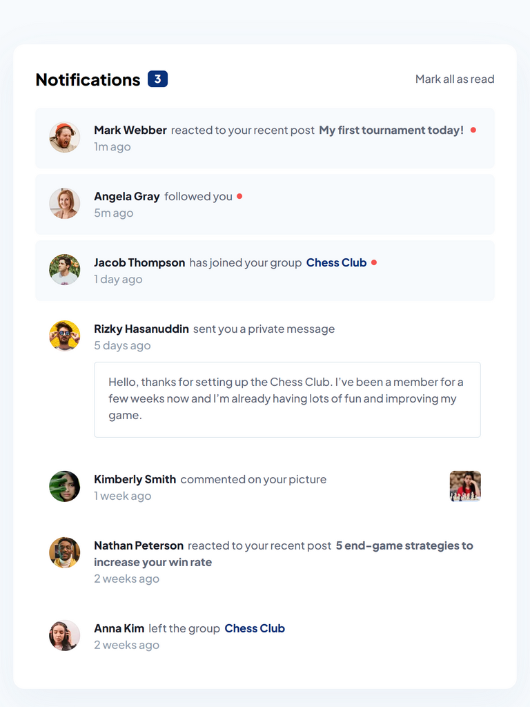

# Frontend Mentor - Notifications page solution

This is a solution to the [Notifications page challenge on Frontend Mentor](https://www.frontendmentor.io/challenges/notifications-page-DqK5QAmKbC). Frontend Mentor challenges help you improve your coding skills by building realistic projects.

## Table of contents

- [Overview](#overview)
  - [The challenge](#the-challenge)
  - [Screenshot](#screenshot)
  - [Links](#links)
- [My process](#my-process)
  - [Built with](#built-with)
  - [What I learned](#what-i-learned)
  - [Useful resources](#useful-resources)
- [Author](#author)

## Overview

### The challenge

Users should be able to:

- Distinguish between "unread" and "read" notifications
- Select "Mark all as read" to toggle the visual state of the unread notifications and set the number of unread messages to zero
- View the optimal layout for the interface depending on their device's screen size
- See hover and focus states for all interactive elements on the page

### Screenshot



### Links

- Solution URL: [github.com/miranlegin/fem-notifications-page](https://github.com/miranlegin/fem-notifications-page)
- Live Site URL: [frontend-mentor-challenge-25.netlify.app](https://frontend-mentor-challenge-25.netlify.app/)

## My process

### Built with

- React with Vite
- Vanilla CSS

### What I learned

After creating static version of this challenge i extracted the code into components and made initial state of the app. Then all there is needed to do was handle some logic for clearing the unread messages and updating message count. Snippet below is responsible for these functionality.

```js
function clearNotificationsHandler() {
  const clearedNotifications = notifications.map((notification) => ({
    ...notification,
    status: true,
  }));

  setNotifications(clearedNotifications);
}

const unreadNotifications = notifications.filter(
  (notification) => notification.status === false
);
```

### Useful resources

- [react.dev](https://react.dev/learn) - Goto place for everything React!

## Author

- Frontend Mentor - [@miranlegin](https://www.frontendmentor.io/profile/miranlegin)
